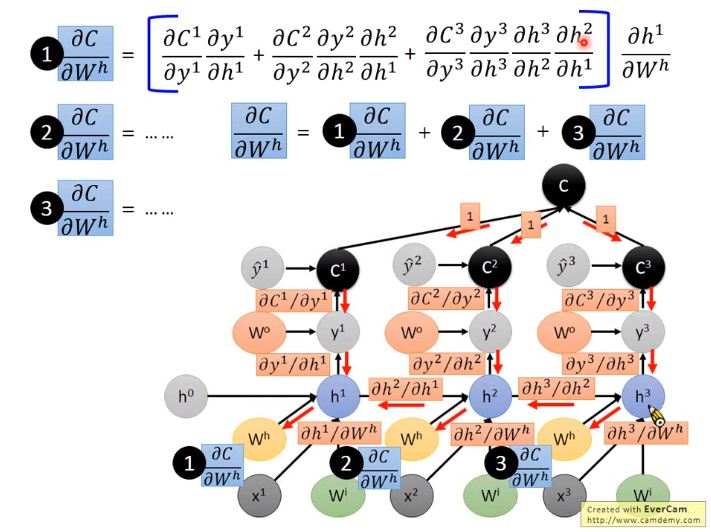
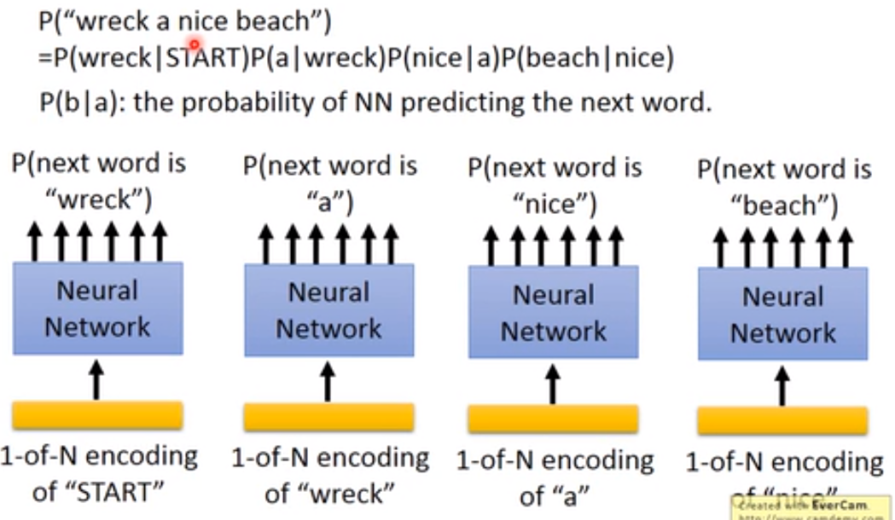
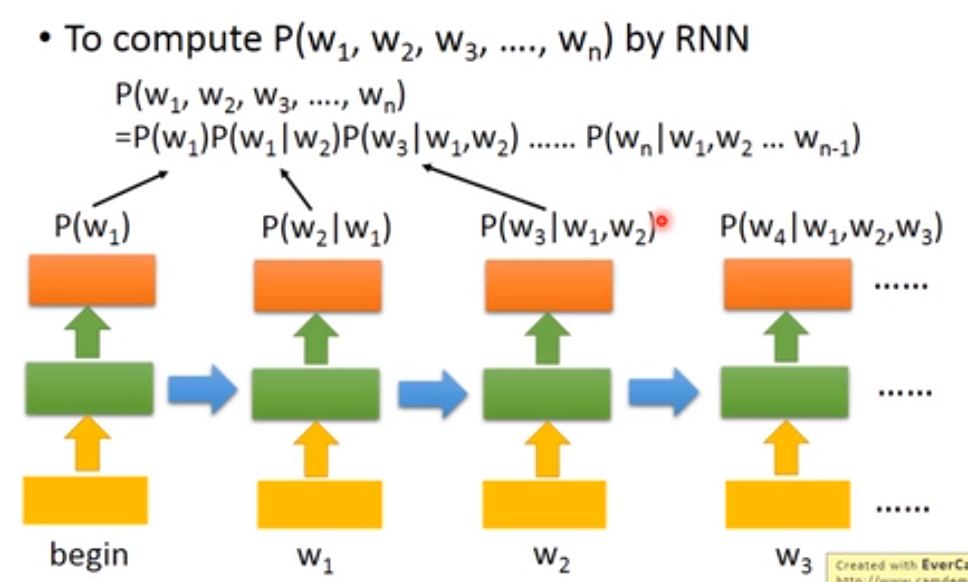

# Review: Basic Structures for Deep Learning Models

- Three Steps for Deep Learning

  1. Neural network

     We design the network structure, and let machine find parameters form data.

  2. Cost funcition

     Cost funciton evaluates how good a set of paramters is.

  3. Optimization

     Find the best function set.(e.g. gradient descent)

- Basic structure

  - **Fully connected layer**
  - **Recurrent structure**
  - **Convolutional/Pooling layer**

### 1. Fully Connected Layer

  - Output of a neuron

    $a_i^l$: layer $l$, neuron i

  - Output of one layer

    $a^l$: a vector

  - Weight

    $w_{ij}^l$: layer $l$-1 to layer $l$ , from neuron $j$ (layer $l$-1) to neuron $i$ (layer $l$ )

    $W^l \in [N_l,N_{l-1}]$ 

  - Bias

    $b_i^l$: bias for neuron $i$ at layer $l$

    $b^l$: bias for all neurons in layer $l$

  - Input

    $z_i^l$: input of the activation function for neuron $i$ at layer $l$

    $z^l$: input of the activation function for all neuron in layer $l$

    $z_i^l=w_{i1}^la_1^{l-1}+w_{i2}^la_2^{l-1}+...+b_i^l$

    $z_i^l=\sum _{j=1}^{N_{l-1}}w_{ij}^la_j^{l-1}+b_i^l$

  - Relations between layer outputs

    $z^l=W^la^{l-1}+b^l$

    $a^l=\sigma(z^l)$
    $$
    a^l=\sigma(W^lz^{l-1}+b^l)
    $$

### 2. Recurrent structure

Given funciton f: $h^{'},y=f(h,x)$

- **Deep RNN**

  $h^{'},y=f_1(h,x)$

  $b^{'},c=f_2(b,y)$

- **Bidirectional RNN**

  $h^{'},y=f_1(h,x)$

  $b^{'},c=f_2(b,x)$  #it's different

- **Pyramidal RNN**

  Reducing the number of time steps.

- **Naive RNN**

  $h^{'},y=f(h,x)$

  $h^{'}=\sigma(W^hh+w^ix)$

  $y = \sigma(W^oh^{'})$

- **LSTM**

  two intput vectors + one x input vectors:

  **c**: c change slowly ($c^t$ is $c^{t-1}$ added by sth)

  **h**: h change falster ($h^t$ is $h^{t-1}$ can be very different )
  $$
  z=tanh(W \left[
   \begin{matrix}
     x^t  \\
     h^{t-1} 
    \end{matrix}
    \right] )
  $$

  $$
  z^i=\sigma(W^i \left[
   \begin{matrix}
     x^t  \\
     h^{t-1} 
    \end{matrix}
    \right])
  $$

  $$
  z^f=\sigma(W^f \left[
   \begin{matrix}
     x^t  \\
     h^{t-1} 
    \end{matrix}
    \right])
  $$

  $$
  z^o=\sigma(W^o \left[
   \begin{matrix}
     x^t  \\
     h^{t-1} 
    \end{matrix}
    \right])
  $$

  $c^t=z^f\odot c^{t-1}+z^i\odot z$

  $h^t = z^o\odot \tanh(c^t)$

  $y^t=\sigma(W^{'}h^t)$

- **GRU** (Gated Recurrent Unit )

  reset: $r=\sigma(W^r[h^{t-1},x^t])$

  $h^{'}=\sigma(W^h[h^{t-1}\odot r,x^t])$

  $h^t = z\odot h^{t-1}+(1-z)\odot h^{'}$

  $y^t=\sigma(W^{'}h^t)$

- **Stack RNN**

  blabla

### 3. Convolutional/Pooling layer

- Convolutional layer
  - Sparse Connectivity

    Each neural noly connects to part of the output of the previous layer.

  - Receptive Field

    Different neurons have different, but overlapping, receptive fields.

  - Parameter Sharing

    The neurons with different receptive fields can use the same set of parameters.

  - Filter

    neurons which share the same parameter.

    fileter(kernel) size: size of the receptive field of a neuron.

- Pooling layer

  Layer $l$-1: N nodes     -> k outputs in layer $l$-1 are grouped together

  Lyaer $l$:   N/k nodes   -> Each output in layer $l$ summarizes k inputs

  - Average Pooling:

    $a^l_1=\frac{1}{k}\sum_{j=1}^ka^{l-1}_j $

  - Max Pooling:

    $a^l_1=\max(a^{l-1}_1,a^{l-1}_2,...,a^{l-1}_3)$

  - L2 Pooling:

    $a^l_1=\frac{1}{k} \sqrt{\sum_{j=1}^k(a_j^{l-1})^2}$

  Which outputs should be grouped together ?

  - Group the neurons corresponding to the same filter with nearby receptive fields.
  - Group the neurons with the same receptive field.

# Computational Graph & Back propagation

- Computational Graph 

  Node: variable (scalar,vector,tensor)

  Edge: operation (simple function)

  - Parameter sharing: the same parameters appearing in different nodes

### Computing Gradient Using Traditional Approach

$$
  \frac{\partial C}{\partial w_{ij}^l}=\frac{\partial z_i^l}{\partial w_i^l}\frac{\partial C}{\partial z_i^l}
$$

  - **Forward Pass**

    $\frac{\partial z_i^l}{\partial w_i^l}$ = $a_j^{l-1}\ (l>1)$

    $a^{l-1} = \sigma(W^{l-1}a^{l-2}+b^{l-1})$  

  - **Backward Pass**

    Error Signal: $\frac{\partial C}{\partial z_i^l}=\delta_i^l$
    $$
    \bigtriangledown _yC = [\frac{\partial C}{\partial y_1},\frac{\partial C}{\partial y_2},...,\frac{\partial C}{\partial y_n}]^T
    $$
    Layer L : $\delta^L=\sigma^{'}(z^L)\bullet  \bigtriangledown _yC$

    Layer L -1: $\delta^{L-1}=\sigma^{'}(z^{L-1})\bullet  (W^{L})^T\delta^L$

    ......

    Layer $l$: $\delta^{l}=\sigma^{'}(z^{l})\bullet  (W^{l+1})^T\delta^{l+1}$

    ......

### Computing Gradient Using Computational Graph

  - Gradient of Cost Function

    $C=L(y,\hat{y})$

  - Jacobian Matrix

    Assume $F$: $R_n\to R_m $ . 

    $F$ is combined by m real function: $y_1(x_1,...,x_n),...,y_m(x_1,...,x_n) $

    Jacobian Matrix is:
    $$
    \left[
     \begin{matrix}
     \frac{\partial y_1}{\partial x_1} &...&\frac{\partial y_1}{\partial x_n}\\
     ...  &...&...\\
      \frac{\partial y_m}{\partial x_1}&...&\frac{\partial y_m}{\partial x_n}
      \end{matrix}
      \right] )
    $$

    - $\frac{\partial C}{\partial y}$

      $C = -\log y_r​$ ($\hat{y_r}=1$)

      $\frac{\partial C}{\partial y_i} = -1/y_r$  (if $i=r$)

      $\frac{\partial C}{\partial y_i} = 0$  (if $i\neq  r$)

      so $\frac{\partial C}{\partial y} = [0\  \ ...\ -1/y_r\ ...]$  

    - $\frac{\partial y}{\partial z}$

      $\frac{\partial y}{\partial z}$ is a square Jacobian Matrix.

      if $y_i=\sigma(z_i)$, it's a diagonal matrix.

    - $\frac{\partial z}{\partial a}$

      $\frac{\partial z_i}{\partial a_j} = W_{ij}$

      so $\frac{\partial z}{\partial a} = W$

    - $\frac{\partial z}{\partial W} $

      $\frac{\partial z_i}{\partial W_{jk}}=a_k $ (if $i = j$)

    - Final
      $$
      \frac{\partial C}{\partial w_{ij}^l}=Multiply\ Everything
      $$
      
### Computational Graph for Recurrent Network

- Recurrent Network

  $y^t,h^{t}=f(x^t,h^{t-1};w^i,W^h,W^o)$

  $h^t=\sigma(W^ix^t+W^hh^{t-1})$

  $y^t=softmax(W^oh^t)$

  

# Deep Learning for Language Modeling

- Language model

  Estimated the probability of word sequence.

  Word sequence: $w_1,w_2,w_3,...,w_n$

  Estimate: $P(w_1,w_2,w_3,...,w_n)$

- Application

  1. speech recognition: Different word sequence can have the same pronunciation.
  2. sentence generation

- 2-gram

  how to Estimate: $P(w_1,w_2,w_3,...,w_n)$?

  N-gram language model: $P(w_1,w_2,w_3,...,w_n)=P(w_1|start)P(w_2|w_1)...P(w_n|w_{n-1})$

  $P(A|B)=\frac{count\ of\ "A\ B"}{count\ of\ "A"}$

- NN-based Language Modeling

  

- RNN-based LM

  

- Language model smoothing

  Give some small probability to whose probability is zero.

  **Matrix Factorization**:

  $Table(v^i,h^j) = \{...,n_{ij}=P(B|A)=v^i\cdot h^j,...\}$

   h: history , v: vocabulary

  Minimizing: $L=\sum _{(i,j)}(v^i\cdot h^j-n_{ij})^2$

  NOTE: History a and b can have similar vecotr $h^a$ and $h^b$. If $v^x\cdot h^a$ is large,$v^x \cdot h^b$ would be large accordingly. Even if we have never seen "b x".

  

  
